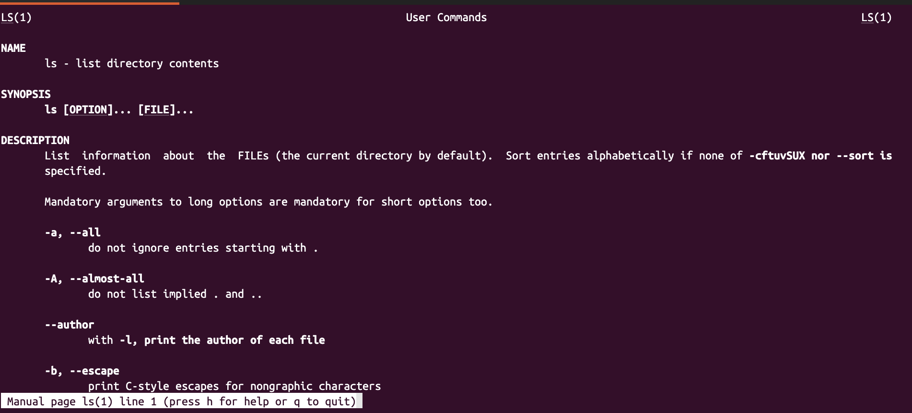

# `man <command>`

## Description

The `man` command displays a _manual_ page for the `<command>`.

It provides _detailed_ documentation, including a description, the options `<command>` accepts and examples.

### How to navigate through the `man` page

- Use the ↓ and ↑ arrow keys to move down and up the page one _line_ at a time.
- Use Spacebar or `f` to move _forward_ one _page_ at a time.
- Use `b` to move _back_ one _page_ at a time
- Use `G` to jump to the end of the page.
- Use `1G` to jump to the beginning of the page.

### How to search the `man` page

To search the `man` page for a character or word, use `/` followed by the character or word. If there are multiple results:

- Use `n` to jump to the next result.
- Use `N` to jump to the previous result.

### How to quit the `man` page

To quit the `man` page, type `q`.

> [!NOTE]
> To learn more about a command in Linux, you can also use `<command> --help`, which displays a _short summary_ of the `<command>` and its options and acts as a quick reference. The `--help` option is only available on Linux, whereas the `man` command is available on both macOS and Linux.

## Example

```sh
man ls
```


